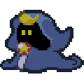
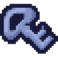

# Paper Mario Randomizer Map Tracker

This tracker is integrated with [Emotracker](https://emotracker.net/) by Phantom5800. Provides full logic map tracking for [Paper Mario Randomizer](https://pm64randomizer.com/).

* Supports horizontal and vertical layouts, example of the vertical layout below:

## Randomized Item Settings

*  **Shopsanity**

  * Items in shops can contain items.

*  **Rowf Items**

  * Rowf's badge shop can contain progression.

*  **Merlow**

  * Merlow's shop reward items can be required for progression. The regular shop items can never be required.

*  **Keysanity**

  * Dungeon key items can be found anywhere.

*  **Panels**

  * All 32 Hidden panels are shuffled into the item pool.

*  **Overworld Coins**

  * Free standing coins are shuffled into the item pool.

*  **Coin Blocks**

  * Blocks normally containing single coins are shuffled into the item pool.

*  **Foliage Coins**

  * Coins found in bushes and trees are shuffled into the item pool.

*  **Letters**

  * Letter rewards are shuffled into the item pool. The tracker will assume all letters, though you can set different letters to be required in the randomizer.

*  **Dojo**

  * Dojo fight rewards are included in the item pool.

*  **Koopa Koot**

  * Koopa Koot quest rewards are added to the item pool.

*  **Trading Event Toad**

  * The trading event from a radio in Koopa Village is shuffled into the item pool.

*  **Partner Upgrade Shuffle**

  * Super Blocks are shuffled into the item pool.

*  **Multicoin/Upgrade Block Shuffle**

  * 10 coin blocks are shuffled with super block locations.

*  **Dungeon Entrance Shuffle**

  * Dungeon entrances are shuffled among each other.

## Open Area Settings

*  **Hidden Blocks**

  * Hidden blocks are set to always be visible. If disabled, Watt is logically expected to access these checks.

*  **Partners Always Usable**

  * Partner abilities are always usable in the overworld, whether you have obtained them or not.

*  **Prologue Open**

  * Goomba King has already been defeated and the bridge leading to Toad Town is down.

*  **Blue House Open**

  * The Blue House in Toad Town is already unlocked.

*  **Cook Without Frying Pan**

  * Tayce T. is able to cook whether you have found the *Frying Pan* or not.

*  **Mt. Rugged Open**

  * The rock blocking the train in Toad Town is already blown up.

*  **Forever Forest Open**

  * Oaklie will block the second room of Forever Forest when this setting is disabled until the *Forest Pass* is found.

*  **Toybox Open**

  * The Toybox entrance is accessible without *Bow*.

*  **Whale Open**

  * Fuzzipede has already been defeated and the Whale will take you to Lavalava Island.

*  **Ch7 Bridge Visible**

  * The blocks leading to chapter 7 can be jumped on without first being hit.